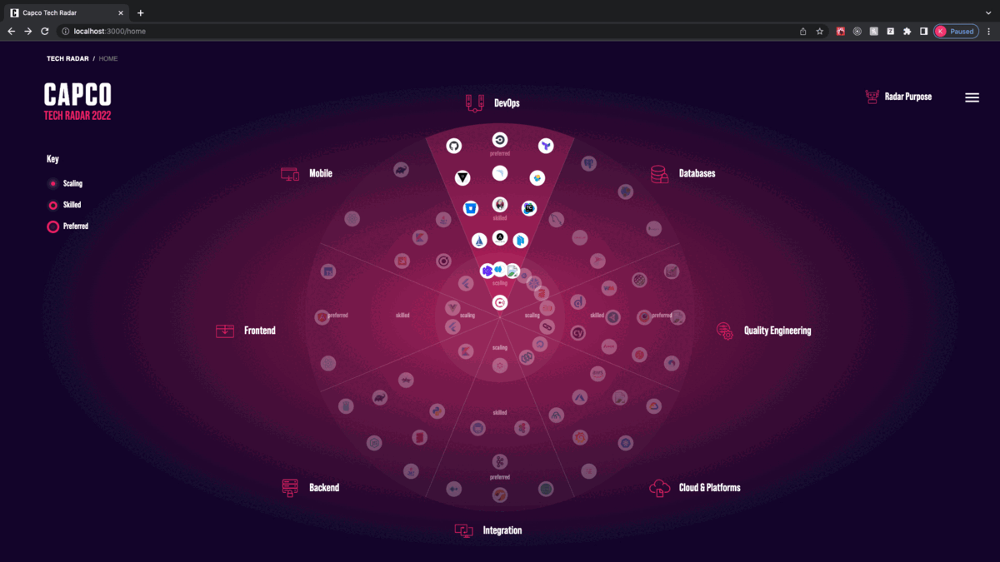

[![Contributors][contributors-shield]][contributors-url]
[![Forks][forks-shield]][forks-url]
[![Stargazers][stars-shield]][stars-url]
[![Issues][issues-shield]][issues-url]
[![MIT License][license-shield]][license-url]

<!-- PROJECT LOGO -->
<br />
<p align="center">
  <a href="https://github.com/capcodigital/tech-radar">
    
  </a>

  <h3 align="center">Engineering Tech Radar</h3>

  <p align="center">
    Performance management framework designed by Engineers for Engineers at Capco
    <br />
    <br />
    <a href="https://framework.capco.io">View Demo</a>
    ·
    <a href="https://github.com/capcodigital/engineering-framework/issues">Report Bug</a>
    ·
    <a href="https://github.com/capcodigital/engineering-framework/issues">Request Feature</a>
  </p>
</p>

<!-- TABLE OF CONTENTS -->
<details open="open">
  <summary><h2 style="display: inline-block">Table of Contents</h2></summary>
  <ol>
    <li>
      <a href="#about-the-project">About The Project</a>
      <ul>
        <li><a href="#built-with">Built With</a></li>
      </ul>
    </li>
    <li>
      <a href="#getting-started">Getting Started</a>
      <ul>
        <li><a href="#installation">Installation</a></li>
      </ul>
    </li>
    <li><a href="#development">Development</a></li>
    <li><a href="#roadmap">Roadmap</a></li>
    <li><a href="#contributing">Contributing</a></li>
    <li><a href="#license">License</a></li>
    <li><a href="#contact">Contact</a></li>
    <li><a href="#acknowledgements">Acknowledgements</a></li>
  </ol>
</details>

<!-- ABOUT THE PROJECT -->

## About The Project

[](https://github.com/capcodigital/tech-radar/actions/workflows/tests.yml)



An application that allows Engineers to explore the Engineering performance management framework used in Digital Engineering at Capco.

### Built With


| Description                                                                | Link                                                  |
| :------------------------------------------------------------------------- | :---------------------------------------------------- |
| React - JavaScript library for building user interfaces                    | [React](https://github.com/facebook/create-react-app) |
| Cypress - JavaScript E2E Testing Framework                                 | [Cypress](https://www.cypress.io/)                    |
| React Testing Library - light-weight solution for testing React components | [React Testing Library](https://www.cypress.io/)      |
| Library that utilises tagged template literals to style React components   | [Styled Components](https://styled-components.com/)   |

<!-- GETTING STARTED -->

## Getting Started

To get a local copy up and running follow these simple steps.

### Installation

```shell
# clone the repo
git clone https://github.com/capcodigital/tech-radar.git

# installs the dependencies
npm install
```

<!-- USAGE EXAMPLES -->

## Development

### Commands

- `npm start` - start the react app
- `npm test` - run unit tests
- `npm run cypress` - run e2e ui tests

### CI/CD

Unit and E2E UI tests are automated via [GitHub Actions](https://github.com/capcodigital/tech-radar/actions).

<!-- ROADMAP -->

## Roadmap

See the [open issues](https://github.com/capcodigital/tech-radar/issues) for a list of proposed features (and known issues).

<!-- CONTRIBUTING -->

## Contributing

Contributions are what make the open source community such an amazing place to be learn, inspire, and create. Any contributions you make are **greatly appreciated**.

1. Fork the Project
2. Create your Feature Branch (`git checkout -b feature/AmazingFeature`)
3. Commit your Changes (`git commit -m 'Add some AmazingFeature'`)
4. Push to the Branch (`git push origin feature/AmazingFeature`)
5. Open a Pull Request

If you would like to contribute to any Capco Digital OSS projects please read:

- [Code of Conduct](https://github.com/capcodigital/.github/blob/master/CODE_OF_CONDUCT.md)
- [Contributing Guidelines](https://github.com/capcodigital/.github/blob/master/CONTRIBUTING.md)

<!-- LICENSE -->

## License

Distributed under the MIT License. See `LICENSE` for more information.

<!-- ACKNOWLEDGEMENTS -->

## Acknowledgements

- [Best README Template](https://github.com/othneildrew/Best-README-Template/blob/master/README.md)

<!-- MARKDOWN LINKS & IMAGES -->
<!-- https://www.markdownguide.org/basic-syntax/#reference-style-links -->

[contributors-shield]: https://img.shields.io/github/contributors/capcodigital/engineering-framework.svg?style=for-the-badge
[contributors-url]: https://github.com/capcodigital/engineering-framework/graphs/contributors
[forks-shield]: https://img.shields.io/github/forks/capcodigital/engineering-framework.svg?style=for-the-badge
[forks-url]: https://github.com/capcodigital/engineering-framework/network/members
[stars-shield]: https://img.shields.io/github/stars/capcodigital/engineering-framework.svg?style=for-the-badge
[stars-url]: https://github.com/capcodigital/engineering-framework/stargazers
[issues-shield]: https://img.shields.io/github/issues/capcodigital/engineering-framework.svg?style=for-the-badge
[issues-url]: https://github.com/capcodigital/engineering-framework/issues
[license-shield]: https://img.shields.io/github/license/capcodigital/engineering-framework.svg?style=for-the-badge
[license-url]: https://github.com/capcodigital/engineering-framework/blob/master/LICENSE
